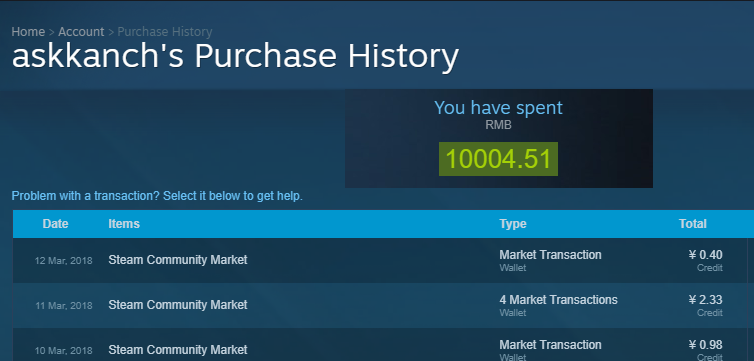

# HMMC - How Much Money Do I Cost On Steam

下面这个JavaScript函数可以用来帮助你计算你在Steam上一共消费了多少钱。它可以算出你在商店/游戏内购/社区市场里面所有的消费总额（零售key激活/礼物/代购的无法计算）。也就是说，你的实际消费总量肯定比脚本算出来的多。

使用前需要打开Steam账户的历史钱包消费记录页面:[https://store.steampowered.com/account/history/](https://store.steampowered.com/account/history/)

然后打开浏览器控制台，调用该函数即可。

当然你也可以通过GreasyFork将其安装在Tampermonkey中。[脚本GreasyFork页面](https://greasyfork.org/en/scripts/38914-hmmc-how-much-money-do-i-cost-on-steam)

脚本会在页面顶部显示花费总额，如下图： 

函数代码如下：

```javascript
function hmmc(){
    //currency exchange
    var CUR = ['¥','$','€','£','₽','CDN$','₩'];
    var CUR_RMB = [1.0,6.3,7.7,8.8,0.1,5,0.0059];

    //box to show info
    var loading = `<div class="home_area_spotlight" style="height:80px;width:100%;display:inline-block;">
                   <div class="spotlight_content" style="width:100%;text-align:center;">
                      <h2>Loading the costs in </h2>
                      <div class="spotlight_body">RMB </div>
                      <div class="spotlight_body spotlight_price price">
                         <div class="discount_block discount_block_spotlight discount_block_large">
                            <div class="discount_pct" id="spent_money">wait few seconds...</div>
                         </div>
                      </div>
                   </div>
                   <div class="ds_options">
                      <div></div>
                   </div>
                </div>`;

    var donestr = `<div class="home_area_spotlight" style="height:80px;width:100%;display:inline-block;">
                   <div class="spotlight_content" style="width:100%;text-align:center;">
                      <h2>You have spent</h2>
                      <div class="spotlight_body">RMB </div>
                      <div class="spotlight_body spotlight_price price">
                         <div class="discount_block discount_block_spotlight discount_block_large">
                            <div class="discount_pct" id="spent_money">@SPENT@</div>
                         </div>
                      </div>
                   </div>
                   <div class="ds_options">
                      <div></div>
                   </div>
                </div>`;
    // target div before our box
    var ppt = document.querySelector("body > div.page_header_ctn.account_management");
    ppt.insertAdjacentHTML("afterend", loading);

    //load all wallet transactions

    console.log("Loading all transactions...."); 
    WalletHistory_LoadMore();

    console.log("done.\r\nWaiting for 8 seconds..."); 
     setTimeout(function() {
        //extract all transactions
        var costRM = [];
        var cc = document.getElementsByClassName('wht_wallet_change');
        var change = document.getElementsByClassName('wht_total');
        var balance = document.getElementsByClassName('wht_wallet_balance');
        for (var i = 1; i < cc.length; i++) {
            if(change[i].textContent.length >1){
                //check if it is expenditure
                if((cc[i].textContent.length > 3 && cc[i].textContent[0]=='-') || (cc[i].textContent.length < 2 && balance[i].textContent.length < 2)){
                    var vv =  change[i].textContent.replace(/[^\-+.0-9]/g,'');
                    var oly = change[i].textContent.replace(/[^\-+.0-9฿₵¢₡B₫€ƒ₲Kč₭£₤₥₦₱₨₽$₮₩¥₴₪֏¥]/g,'');
                    //convert currency to RMB 
                    vv = CUR_RMB[CUR.indexOf(oly[0])]*parseFloat(vv);
                    costRM.push( parseFloat(vv) );
                }
            }
        }

        // compute all cost
        var X = costRM.reduce(function(a, b) { return a + b; }, 0);
        console.log('done.\r\n-\r\n-\r\nYou have cost ¥ ' + Number((X).toFixed(2)) + ' RMB on Steam so far.\r\n-\r\n-\r\n');
        document.querySelector("body > div.home_area_spotlight").remove();
        ppt.insertAdjacentHTML("afterend", donestr.replace("@SPENT@",Number((X).toFixed(2))));
     },8888);
}
```


